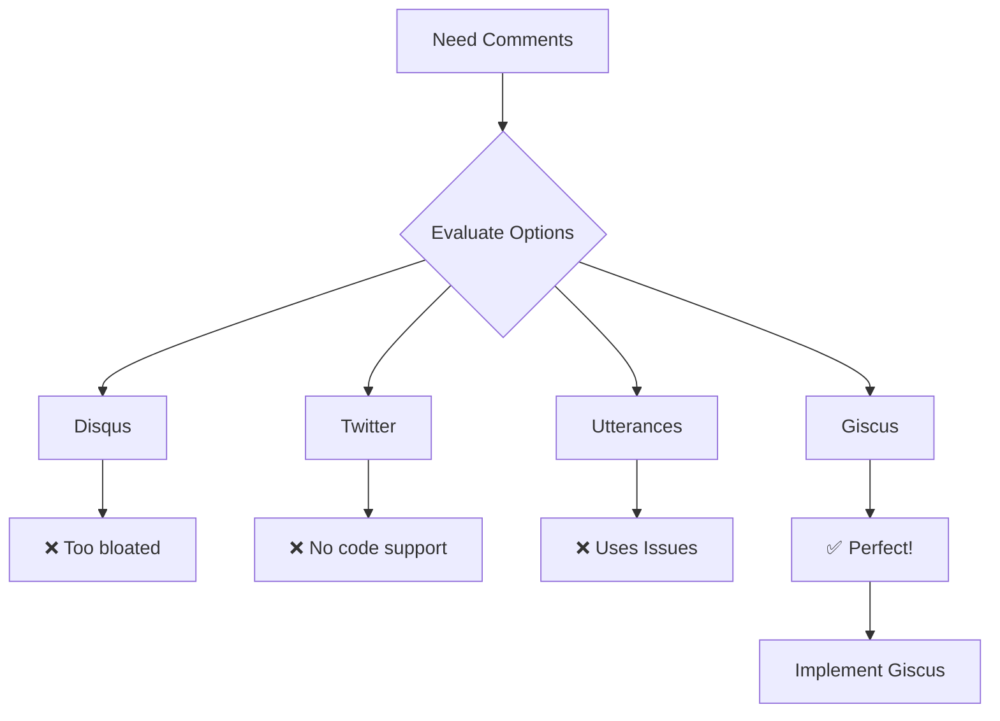

## The Requirement

After launching my portfolio with a blog, I wanted readers to engage - ask questions, share feedback, discuss content.

But I had constraints:

✅ **No backend** - Static site, keep it simple

✅ **No database** - Zero infrastructure overhead

✅ **Developer-friendly** - My audience is developers

✅ **Markdown support** - Code formatting matters

✅ **Theme support** - Must match dark/light mode

✅ **Free** - Open source preferred

✅ **Privacy-friendly** - No tracking, no ads

---

## The Problem

Most commenting systems fail at least one requirement:

**Traditional solutions:**

- Disqus → Ads, tracking, bloated
- Self-hosted → Database, auth, maintenance
- Twitter embeds → No code formatting, not SEO friendly

**What I needed:**
A commenting system that feels native to developer portfolios - where technical discussions happen naturally, with code formatting, and zero infrastructure.

---

## The Solutions

I evaluated three main options:

### Option 1: Disqus

**Pros:**

- Popular and mature
- Easy to integrate
- Handles moderation

**Cons:**

- ❌ Ads on free tier
- ❌ Privacy concerns (tracking)
- ❌ Heavy (slow page loads)
- ❌ Not developer-focused

**Verdict:** Too bloated for a developer portfolio.

---

### Option 2: Twitter/X Replies

**Pros:**

- Social engagement
- Viral potential
- No setup needed

**Cons:**

- ❌ Requires Twitter account
- ❌ No code formatting
- ❌ Comments live on Twitter, not my site
- ❌ Not SEO friendly

**Verdict:** Good for promotion, not for technical discussions.

---

### Option 3: Utterances

**Pros:**

- ✅ GitHub Issues based
- ✅ Free and open source
- ✅ Markdown support
- ✅ Lightweight

**Cons:**

- ❌ Uses Issues (not ideal for comments)
- ❌ No reactions
- ❌ Limited features

**Verdict:** Close, but Giscus is better.



---

## Why Giscus

Giscus is Utterances 2.0 - powered by **GitHub Discussions** instead of Issues.

**What makes it perfect:**

**1. Developer-First**
My audience is developers. They already have GitHub accounts. Zero friction.

**2. Markdown + Code**
Full GitHub Flavored Markdown support. Code blocks, tables, everything.

**3. Zero Infrastructure**
Comments live in GitHub Discussions. No database, no backend, no maintenance.

**4. Reactions**
👍 ❤️ 🎉 Quick feedback without full comments.

**5. Ownership**
My repo, my discussions, my data. Export, backup, or migrate anytime.

**6. Moderation**
GitHub's moderation tools built-in. Edit, delete, or lock discussions.

**7. Theme Support**
Auto-switches between dark/light mode with my site.

**8. Free Forever**
Open source, no ads, no tracking, no limits.

**Comparison:**

| Feature   | Giscus      | Utterances | Disqus   | Twitter |
| --------- | ----------- | ---------- | -------- | ------- |
| Backend   | None        | None       | Yes      | Yes     |
| Auth      | GitHub      | GitHub     | Email    | Twitter |
| Markdown  | ✅          | ✅         | ❌       | ❌      |
| Reactions | ✅          | ❌         | ✅       | ✅      |
| Free      | ✅          | ✅         | Ads      | ✅      |
| Privacy   | ✅          | ✅         | ❌       | ❌      |
| Uses      | Discussions | Issues     | Database | Tweets  |

**The winner:** Giscus checks every box. 🎯

---

## Implementation: Step-by-Step

### Step 1: Create Public Repo

I had a private repo for my portfolio code. Giscus needs a **public** repo for discussions.

**Options:**

- Make portfolio repo public (I chose this)
- Create separate public repo just for comments

I went public because:

- Shows my code quality
- Open source contribution
- Helps others learn

---

### Step 2: Enable GitHub Discussions

1. Go to repo Settings
2. Features → Check "Discussions"
3. Create categories:
   - **Blog Comments** (Open-ended discussion)
   - **Project Discussions** (Open-ended discussion)

**Why separate categories?**

- Organized discussions
- Easy to find blog vs project comments
- Better analytics

---

### Step 3: Install Giscus App

1. Visit [github.com/apps/giscus](https://github.com/apps/giscus)
2. Click "Install"
3. Select your portfolio repo
4. Authorize

This allows Giscus to create discussions on your behalf.

---

### Step 4: Configure on giscus.app

Go to [giscus.app](https://giscus.app) and fill in:

**Repository:**

```
yourusername/portfolio-repo
```

**Page ↔️ Discussions Mapping:**

- Choose "pathname"
- Each URL gets its own discussion

**Discussion Category:**

- Select "Blog Comments" for blogs
- Select "Project Discussions" for projects

**Features:**

- ✅ Enable reactions
- ✅ Emit discussion metadata

**Theme:**

- Choose "preferred_color_scheme"
- Auto-switches with your site theme

Copy the generated values:

- `data-repo-id`
- `data-category-id` (for each category)

---

### Step 5: Create Giscus Component

<CodeBlock
  language="tsx"
  filename="src/components/Giscus.tsx"
  code={`"use client";

import { useTheme } from "next-themes";
import { useEffect, useRef } from "react";

type GiscusProps = {
category?: "blog" | "project";
};

export function Giscus({ category = "blog" }: GiscusProps) {
  const ref = useRef<HTMLDivElement>(null);
  const { resolvedTheme } = useTheme();

const theme = resolvedTheme === "dark" ? "dark" : "light";

const config = {
blog: {
category: "Blog Comments",
categoryId: "YOUR_BLOG_CATEGORY_ID",
},
project: {
category: "Project Discussions",
categoryId: "YOUR_PROJECT_CATEGORY_ID",
},
};

const { category: categoryName, categoryId } = config[category];

useEffect(() => {
if (!ref.current || ref.current.hasChildNodes()) return;

    const script = document.createElement("script");
    script.src = "https://giscus.app/client.js";
    script.setAttribute("data-repo", "yourusername/repo");
    script.setAttribute("data-repo-id", "YOUR_REPO_ID");
    script.setAttribute("data-category", categoryName);
    script.setAttribute("data-category-id", categoryId);
    script.setAttribute("data-mapping", "pathname");
    script.setAttribute("data-strict", "0");
    script.setAttribute("data-reactions-enabled", "1");
    script.setAttribute("data-emit-metadata", "0");
    script.setAttribute("data-input-position", "top");
    script.setAttribute("data-theme", theme);
    script.setAttribute("data-lang", "en");
    script.setAttribute("data-loading", "lazy");
    script.crossOrigin = "anonymous";
    script.async = true;

    ref.current.appendChild(script);

}, [theme, categoryName, categoryId]);

// Update theme when it changes
useEffect(() => {
const iframe = document.querySelector<HTMLIFrameElement>(
"iframe.giscus-frame"
);
if (!iframe) return;

    iframe.contentWindow?.postMessage(
      { giscus: { setConfig: { theme } } },
      "https://giscus.app"
    );

}, [theme]);

return <div ref={ref} />;
}`}
/>

**Key features:**

- Theme-aware (switches with your site)
- Category support (blog vs project)
- Lazy loading (performance)
- TypeScript typed

---

### Step 6: Add to Blog Posts

<CodeBlock
  language="tsx"
  filename="app/blog/[slug]/page.tsx"
  code={`import { Giscus } from "@/components/Giscus";

export default function BlogPost() {
  return (
    <article>
      {/* Your blog content */}
      
      <div className="pt-8 border-t">
        <h2 className="text-2xl font-bold mb-4">Comments</h2>
        <Giscus category="blog" />
      </div>
    </article>
  );
}`}
/>

---

### Step 7: Add to Projects (Optional)

```tsx
<Giscus category="project" />
```

Same component, different category. Clean and reusable!

---

## The Result

**What I got:**

- ✅ Comments on every blog post
- ✅ Comments on every project
- ✅ Automatic theme switching
- ✅ Zero maintenance
- ✅ Full Markdown support
- ✅ Reactions and replies
- ✅ Email notifications (via GitHub)

**What it cost:**

- $0 (completely free)
- 30 minutes setup time
- Zero ongoing maintenance

---

## Gotchas & Solutions

### Issue 1: Localhost Creates Discussions

**Problem:** Testing locally creates discussions with `localhost:3000` URLs.

**Solution:** Just delete them from GitHub Discussions. Production URLs will be separate.

**Alternative:** Disable Giscus in development:

<CodeBlock
  language="tsx"
  filename="src/components/Giscus.tsx"
  highlightLines={[10]}
  code={`export function Giscus({ category = "blog" }: GiscusProps) {
  const ref = useRef<HTMLDivElement>(null);
  const { resolvedTheme } = useTheme();

const theme = resolvedTheme === "dark" ? "dark" : "light";

const config = {
// ... config
};

if (process.env.NODE_ENV !== 'production') return null;

// ... rest of component
}`}
/>

---

### Issue 2: Theme Not Switching

**Problem:** Theme doesn't update when toggling dark/light mode.

**Solution:** Use `useEffect` to post message to iframe:

<CodeBlock
  language="tsx"
  filename="src/components/Giscus.tsx"
  code={`useEffect(() => {
  const iframe = document.querySelector("iframe.giscus-frame");
  iframe?.contentWindow?.postMessage(
    { giscus: { setConfig: { theme } } },
    "https://giscus.app"
  );
}, [theme]);`}
/>

---

### Issue 3: Hydration Mismatch

**Problem:** React hydration error with theme.

**Solution:** Use `resolvedTheme` from `next-themes`:

<CodeBlock
  language="tsx"
  filename="src/components/Giscus.tsx"
  code={`const { resolvedTheme } = useTheme();
const theme = resolvedTheme === "dark" ? "dark" : "light";`}
/>

---

## Best Practices

### 1. Separate Categories

Create distinct categories for different content types:

- Blog Comments
- Project Discussions
- General Q&A

### 2. Pathname Mapping

Use "pathname" mapping for clean URLs:

- `/blog/post-1` → One discussion
- `/blog/post-2` → Another discussion

### 3. Lazy Loading

Add `data-loading="lazy"` to improve performance.

### 4. Input Position

Set `data-input-position="top"` so comment box is visible immediately.

### 5. Reactions

Enable reactions for quick feedback without full comments.

---

## Security & Privacy

**Are Giscus IDs secrets?**
No! They're public identifiers, safe to commit to your repo.

**What's actually secret:**

- GitHub Personal Access Tokens
- OAuth Client Secrets
- API Keys with write access

**Giscus IDs are like:**

- Repository names (public)
- Discussion category names (public)
- Just identifiers, not credentials

---

## Performance Impact

**Before Giscus:**

- Page load: ~800ms

**After Giscus:**

- Page load: ~820ms
- Giscus loads async (lazy)
- No blocking, no CLS

**Verdict:** Negligible impact! 🚀

---

## Alternatives I Considered

| Feature   | Giscus | Utterances | Disqus | Commento |
| --------- | ------ | ---------- | ------ | -------- |
| Backend   | None   | None       | Yes    | Yes      |
| Auth      | GitHub | GitHub     | Email  | Email    |
| Markdown  | ✅     | ✅         | ❌     | ❌       |
| Reactions | ✅     | ❌         | ✅     | ❌       |
| Free      | ✅     | ✅         | Ads    | Paid     |
| Privacy   | ✅     | ✅         | ❌     | ✅       |

**Why not Utterances?**

- Uses GitHub Issues (not Discussions)
- No reactions
- Less features

Giscus is basically Utterances 2.0!

---

## Conclusion

Adding Giscus was one of the best decisions for my portfolio. It's:

- **Free** - Zero cost
- **Fast** - Minimal performance impact
- **Developer-friendly** - GitHub auth + Markdown
- **Zero maintenance** - No backend to manage
- **Privacy-focused** - No tracking or ads

If you're building a developer portfolio, blog, or documentation site, **use Giscus**. It just works.

---

## Quick Start

Want to add Giscus to your site? Here's the TL;DR:

1. Make repo public
2. Enable Discussions
3. Install Giscus app
4. Configure at giscus.app
5. Copy component code above
6. Add to your pages

Total time: 30 minutes.

---

## Resources

- [Giscus Website](https://giscus.app) - Official documentation and configuration
- [Giscus GitHub](https://github.com/giscus/giscus) - Source code and issues
- [My Implementation](https://github.com/mandharet/portfolio-next) - See it in action

---

**Have questions about Giscus?** Drop a comment below! (Yes, powered by Giscus 😉)
