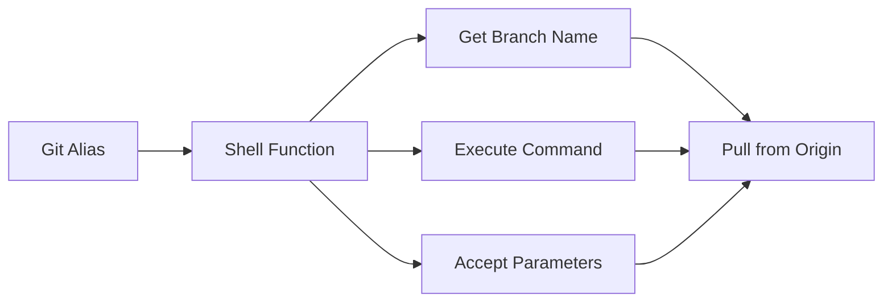
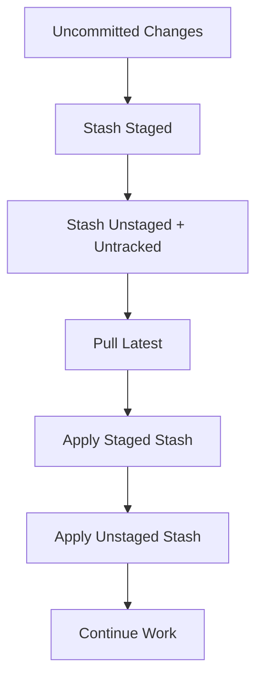
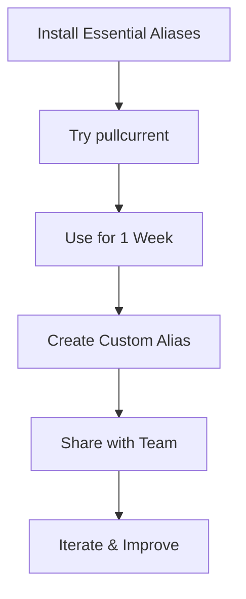

## 1. Why Git Aliases Matter

Typing `git pull origin feature/user-authentication-with-oauth2-integration` repeatedly wastes time. With aliases, type `git pullcurrent` instead - saving 51 keystrokes per command.

Git aliases are custom shortcuts for frequently used commands, making your workflow faster and more efficient.

**Platform Note:** I'm a Windows developer who lives in Git Bash - it's my primary CLI for everything. These aliases assume a POSIX shell (Git Bash, zsh, bash) and use commands like `grep`, `xargs`, and `$(...)` syntax. All commands work perfectly on Linux, macOS, and Windows via Git Bash. PowerShell users will need to adapt shell function aliases.

---

## 2. Understanding Git Aliases

### Simple Aliases

Direct command replacements:

```bash
git config --global alias.st status
# Usage: git st
```

### Shell Function Aliases

Complex commands with logic:

```bash
git config --global alias.pullcurrent '!f() { git pull origin $(git rev-parse --abbrev-ref HEAD); }; f'
```

The `!` prefix tells Git to execute as a shell command.

---

## 3. Alias Anatomy

```bash
alias.pullcurrent = "!f() { git pull origin $(git rev-parse --abbrev-ref HEAD) \"${@}\"; }; f"
```

**Components:**

- `!` - Execute as shell script
- `f() { ... }; f` - Define and execute function
- `$(git rev-parse --abbrev-ref HEAD)` - Get current branch name
- `\"${@}\"` - Accept unlimited parameters



---

## 4. Essential Daily Aliases

### Pull Current Branch

```bash
git config --global alias.pullcurrent '!f() { git pull origin $(git rev-parse --abbrev-ref HEAD) "${@}"; }; f'
```

**Usage:**

```bash
git pullcurrent
git pullcurrent --rebase
```

**Why this over plain `git pull`?** If you've set upstream tracking with

```bash
git config --global push.autoSetupRemote true
```

then plain `git pull` works fine. This alias is useful when:

- Working with branches without upstream set
- Explicitly pulling from origin (not other remotes)
- You prefer explicit branch names in your workflow

---

### Pull Different Branch

```bash
git config --global alias.pd '!f() { git pull origin "$1" "${@:2}"; }; f'
```

**Usage:**

```bash
git pd main
git pd develop --rebase
```

---

### Stash Pull Apply

**Manual workflow:**

```bash
git stash push -m "WIP"
git pull origin develop --rebase
git stash apply
```

**Alias solution:**

```bash
git config --global alias.stashpullapply '!f() { git stash push --staged -m "$1"; git stash push -u -m "leftOver $1"; git pull origin "${2:-$(git rev-parse --abbrev-ref HEAD)}" "${@:3}"; git stash apply stash@{1}; git stash apply stash@{0}; }; f'
```

**Usage:**

```bash
git stashpullapply "WIP: user profile"
git stashpullapply "WIP: fixes" develop --rebase
```

**What it does:**

1. Stashes staged changes (becomes stash@{1} after next stash)
2. Stashes unstaged + untracked changes (becomes stash@{0})
3. Pulls from specified or current branch
4. Applies both stashes back (staged first, then unstaged)

**⚠️ Note:** If conflicts occur during stash apply, resolve them before continuing work.



---

### Config Search

```bash
git config --global alias.configsearch 'config --get-regexp'
```

**Usage:**

```bash
git configsearch credential
git configsearch alias
```

---

### Last Commit

```bash
git config --global alias.last 'log -1 HEAD --stat'
```

Quick verification of recent commit with file changes.

---

### Undo Last Commit

```bash
git config --global alias.undo 'reset HEAD~1 --soft'
```

Removes last commit but keeps changes staged.

---

### Amend Last Commit

```bash
git config --global alias.amend 'commit --amend --no-edit'
```

Adds staged changes to last commit without opening editor.

---

## 5. Useful Additional Aliases

### Quick Add and Commit

```bash
git config --global alias.addcommit '!f() { git add -A && git commit -m "$1"; }; f'
```

**Usage:**

```bash
git addcommit "Fix login bug"
```

---

### Pretty Log

```bash
git config --global alias.prettylog 'log --graph --pretty=format:"%Cred%h%Creset -%C(yellow)%d%Creset %s %Cgreen(%cr) %C(bold blue)<%an>%Creset" --abbrev-commit'
```

Colorful commit history with visual branch graph.

---

### Clean Merged Branches

```bash
git config --global alias.cleanup '!f() { git branch --merged ${1:-main} | grep -v "^\\*\\|main\\|develop" | xargs -r git branch -d; }; f'
```

**Preview before deletion:**

```bash
git branch --merged main
```

**Usage:**

```bash
git cleanup
git cleanup develop
```

**⚠️ Warning:** Review output before running. Squash-merged and rebased branches may not show as "merged" and could be deleted incorrectly. Always verify branch list first with `git branch --merged`.

---

### Find Commits

```bash
git config --global alias.findcommit '!f() { git log --all --grep="$1" --oneline --color; }; f'
```

**Usage:**

```bash
git findcommit authentication
git findcommit "bug fix"
```

---

### File History

```bash
git config --global alias.filehistory '!f() { git log --follow -p --stat -- "$1"; }; f'
```

**Usage:**

```bash
git filehistory src/components/Login.js
```

---

## 6. Creating Custom Aliases

### Step One: Identify Patterns

Track commands you type frequently:

- Multiple times daily
- Long branch names or paths
- Multiple steps
- Hard to remember

### Step Two: Start Simple

```bash
git config --global alias.changed 'diff --name-only'
```

### Step Three: Add Parameters

```bash
git config --global alias.filelog '!f() { git log --follow -p -- "$1"; }; f'
```

### Step Four: Combine Commands

```bash
git config --global alias.quick-commit '!f() { git add -A && git commit -m "$1"; }; f'
```

### Step Five: Add Logic

```bash
git config --global alias.pullcurrent '!f() { git pull origin $(git rev-parse --abbrev-ref HEAD) "${@}"; }; f'
```


---

## 7. Parameter Syntax

| Syntax          | Description                |
| --------------- | -------------------------- |
| `$1, $2, $3`    | Individual parameters      |
| `"$1"`          | First parameter (quoted)   |
| `"${@}"`        | All parameters             |
| `"${@:2}"`      | Parameters from 2nd onward |
| `${1:-default}` | First parameter or default |

---

## 8. Managing Aliases

### View All

```bash
git config --get-regexp alias
```

### Edit

```bash
git config --global --edit
```

### Remove

```bash
git config --global --unset alias.aliasname
```

### Export

```bash
git config --get-regexp alias > my-aliases.txt
```

### Import

To import aliases from a file:

```bash
# Read each line and add to git config
while IFS= read -r line; do
  if [[ $line =~ ^alias\. ]]; then
    key=$(echo "$line" | cut -d' ' -f1 | sed 's/alias\.//')
    value=$(echo "$line" | cut -d' ' -f2-)
    git config --global "alias.$key" "$value"
  fi
done < my-aliases.txt
```

Or manually copy aliases to your `.gitconfig` file.

---

## 9. Aliases I Avoid

Not all aliases are good ideas. Here's what I deliberately don't alias:

**Destructive Commands**

- `git reset --hard` - Too dangerous to abbreviate
- `git push --force` - Should always be explicit
- `git clean -fd` - Needs conscious decision

**Commands That Hide Behavior**

- Aliases that auto-commit without review
- Aliases that silently change branches
- Anything that surprises future-me

**Overlapping Functionality**

- I use `filehistory` over `filelog` - pick one pattern and stick with it
- `addcommit` is my choice over separate add/commit aliases

If an alias makes you think "what did that just do?", it's too clever.

---

## 10. Best Practices

1. **Keep Names Intuitive** - `pullcurrent` over `pc`
2. **Document Complex Aliases** - Add comments in `.gitconfig`
3. **Test First** - Try on test repos
4. **Use Consistent Naming** - Stick to verb-noun patterns
5. **Don't Override Core Commands** - Avoid `alias.commit`
6. **Share with Team** - Help everyone work faster
7. **Start Small** - Build complexity gradually

---

## 11. Common Pitfalls

### Missing Quotes

```bash
# Wrong
git config --global alias.test !f() { echo test; }; f

# Correct
git config --global alias.test '!f() { echo test; }; f'
```

### Unescaped Characters

```bash
# Wrong (in .gitconfig)
alias.test = "!f() { echo "hello"; }; f"

# Correct
alias.test = "!f() { echo \"hello\"; }; f"
```

### Missing Function Wrapper

```bash
# Wrong
alias.test = !git pull origin $1

# Correct
alias.test = '!f() { git pull origin "$1"; }; f'
```

---

## 12. Your .gitconfig File

```ini
[user]
    name = John Doe
    email = john@example.com

[push]
    autoSetupRemote = true

[alias]
    pullcurrent = "!f() { git pull origin $(git rev-parse --abbrev-ref HEAD) \"${@}\"; }; f"
    pd = "!f() { git pull origin \"$1\" \"${@:2}\"; }; f"
    stashpullapply = "!f() { git stash push --staged -m \"$1\"; git stash push -u -m \"leftOver $1\"; git pull origin \"${2:-$(git rev-parse --abbrev-ref HEAD)}\" \"${@:3}\"; git stash apply stash@{1}; git stash apply stash@{0}; }; f"
    configsearch = config --get-regexp
    last = log -1 HEAD --stat
    undo = reset HEAD~1 --soft
    amend = commit --amend --no-edit
```

---

## 13. Quick Start Guide

### Copy/Paste Starter Pack

Install essential aliases in one go:

```bash
# Essential aliases
git config --global alias.pullcurrent '!f() { git pull origin $(git rev-parse --abbrev-ref HEAD) "${@}"; }; f'
git config --global alias.pd '!f() { git pull origin "$1" "${@:2}"; }; f'
git config --global alias.last 'log -1 HEAD --stat'
git config --global alias.undo 'reset HEAD~1 --soft'
git config --global alias.amend 'commit --amend --no-edit'
git config --global alias.configsearch 'config --get-regexp'

# Bonus: Auto setup remote tracking for easier push
git config --global push.autoSetupRemote true
```

### Action Steps



**Action Steps:**

- Install essential aliases today
- Use `pullcurrent` for one week
- Create one custom alias for your most-typed command
- Share favorites with your team

---

## 14. Conclusion

Git aliases transform repetitive tasks into single commands. Start with a few essential aliases, then build custom solutions as patterns emerge in your workflow.

The best alias is one you'll actually use. Start small, iterate, and share what works.

**What's your most-used Git command?** That's your first alias candidate.
