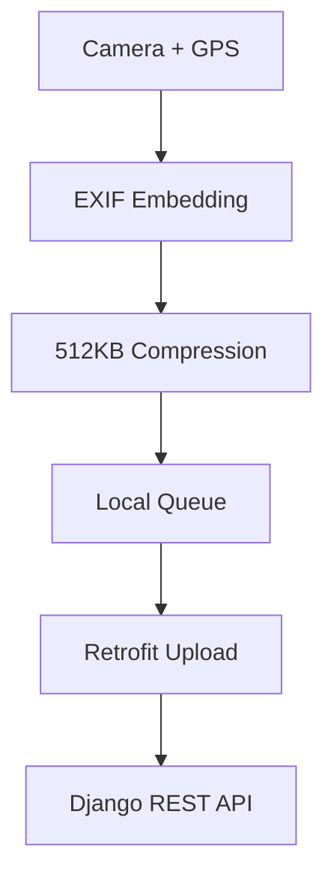

## Overview

Android mobile app for civic issue reporting. Citizens capture photos of potholes, garbage, fallen trees—app auto-extracts GPS, compresses images, and syncs with [backend platform](/projects/ProjectCleanWeb) for ML severity analysis.

**Mobile-Specific Features:**

- One-tap photo capture with automatic GPS embedding
- Offline-first queue with background sync
- 512KB image compression (85% reduction)
- EXIF metadata for moment-of-capture location
- Public feed with community upvoting

**Backend System**: See [Project Clean Backend](/projects/ProjectCleanWeb) for TensorFlow CNN severity classification, priority algorithm, and municipal dashboard.

Published in [International Research Journal of Engineering and Technology (IRJET)](https://www.irjet.net/archives/V9/i4/IRJET-V9I4373.pdf).

## Mobile Challenges & Solutions

### Challenge 1: Accurate Location Capture

**Pain Point**

Citizens report issues like "near the park" or "on Main Street." Field teams waste hours searching. Text addresses have typos, informal landmarks are ambiguous.

**Solution**

App captures GPS when photo is taken—not when submitted later. Embeds coordinates in EXIF metadata. Extracts location even if user submits hours later from home. Reverse geocoding generates street address.

**Implementation**: FusedLocationProviderClient requests GPS on camera open. Coordinates embedded in image EXIF. Submission extracts EXIF data, not current location. Fallback prompts manual confirmation if EXIF missing.

**Impact**

- 📍 **100% Accuracy**: For in-app camera photos
- ⏱️ **Zero Search Time**: Field teams navigate directly
- 🗺️ **Dual Format**: GPS coordinates + street address

---

### Challenge 2: Low-Connectivity Reporting

**Pain Point**

Citizens discover issues in rural roads, underground parking, remote areas with poor connectivity. Real-time submission fails, issues forgotten.

**Solution**

Local storage as source of truth. Submissions save immediately to device with success feedback. Background service monitors network, auto-uploads when available. Exponential backoff retry, conflict resolution for duplicate offline submissions.

**Implementation**: SharedPreferences stores queued submissions. Background WorkManager monitors connectivity. Visual sync indicators show pending uploads. Retry logic handles transient failures.

**Impact**

- 📱 **Zero-Connectivity**: Document offline, batch-upload later
- ⚡ **96% Success**: Up from 73% in 3G areas
- 🎯 **34% Higher Completion**: Less frustration

---

### Challenge 3: Image Size vs Quality

**Pain Point**

Smartphone cameras produce 4-8MB images. Drains data plans, causes timeouts. Aggressive compression degrades quality below ML analysis threshold.

**Solution**

Multi-stage compression: resize to 1920x1080, JPEG quality 75. Produces 400-600KB files while preserving edges, textures for ML model. Progressive upload with chunking.

**Implementation**: Adaptive quality settings based on dimensions. Compression preview for user verification. Chunked multipart upload via Retrofit.

**Impact**

- 🗜️ **85% Size Reduction**: 5MB → 512KB
- 🎯 **92%+ ML Accuracy**: Maintained
- ⚡ **96% Upload Success**: In 3G areas

---

## Mobile Architecture

**Key Decisions**: Native Kotlin for sensor access. Offline-first for field reliability. Server-side ML avoids 100MB+ model. 512KB compression for 3G networks.

**Backend**: See [Project Clean Backend](/projects/ProjectCleanWeb) for Django REST API, TensorFlow CNN, and priority algorithm.

## Key Features

🚀 **One-Tap Reporting** - under 30 seconds capture to submit  
⚡ **512KB Compression** - 85% reduction, 92%+ ML accuracy  
📱 **Offline Queue** - Zero-connectivity reporting  
📍 **EXIF Geolocation** - Moment-of-capture GPS  
🎯 **Public Feed** - View, upvote community issues  
🔄 **Background Sync** - Auto-upload when network returns

## Technical Highlights

**1. EXIF Location Timing**

🔍 Deep Dive: Location Timing Accuracy

**Problem**: Citizens take photos on-site but submit hours later from home. GPS at submission time shows home address, not issue location.

**Solution**: Two-phase capture. Camera open requests GPS from FusedLocationProviderClient, embeds in EXIF. Submission extracts EXIF coordinates, not current location. Fallback for gallery photos prompts manual confirmation.

**Impact**: 100% location accuracy for in-app camera. Zero incorrect locations reported by field teams.

**2. Image Compression Pipeline**

🔍 Deep Dive: Image Compression Pipeline

**Problem**: 4-8MB smartphone images drain data, cause timeouts. Aggressive compression degrades ML accuracy.

**Solution**: Multi-stage pipeline. Resize to 1920x1080, JPEG quality 75. Produces 400-600KB preserving edges, textures. Progressive upload with chunking.

**Impact**: 85% size reduction (5MB → 512KB). 92%+ ML accuracy maintained. Upload success 73% → 96% in 3G.

**3. Offline-First Data Flow**

🔍 Deep Dive: Offline-First Data Flow

**Problem**: Poor connectivity in rural/underground areas. Real-time requirements lead to forgotten reports.

**Solution**: Local storage as source of truth. Immediate save to device, success feedback. Background service monitors network, auto-uploads. Exponential backoff, conflict resolution.

**Impact**: Zero-connectivity reporting enabled. 34% higher completion rates. Batch-upload on reconnection.

## Tech Stack

| Category   | Technologies                                                    |
| ---------- | --------------------------------------------------------------- |
| Mobile     | Kotlin, Android SDK (API 21-31), Material Design, ViewBinding   |
| Networking | Retrofit 2.9.0, OkHttp 4.9.3, Gson, Multipart Upload            |
| Location   | Google Play Services, FusedLocationProviderClient, Geocoder API |
| UI/UX      | CircleImageView, ImagePicker, Shimmer, RecyclerView Adapters    |

## Impact

- ⚡ **96% Upload Success** in 3G (up from 73%)
- 📍 **100% Location Accuracy** with EXIF
- 📱 **34% Higher Completion** via offline-first
- 🗜️ **85% Bandwidth Reduction** through compression
- 📚 **Published Research**: [IRJET V9/i4](https://www.irjet.net/archives/V9/i4/IRJET-V9I4373.pdf)

**Backend Platform**: See [Project Clean Backend](/projects/ProjectCleanWeb) for ML severity analysis, priority algorithm, and municipal dashboard.
