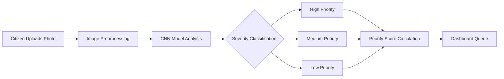
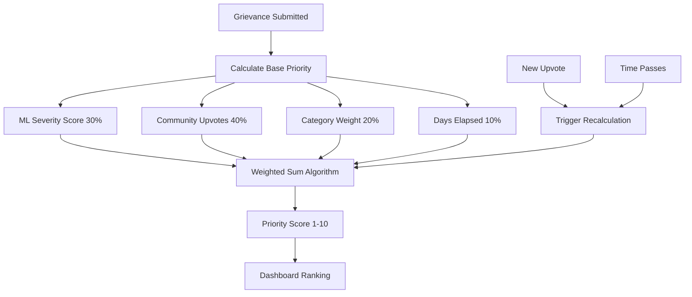
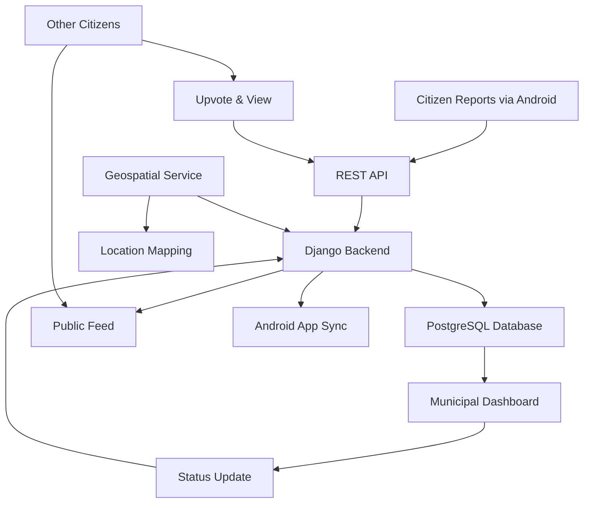
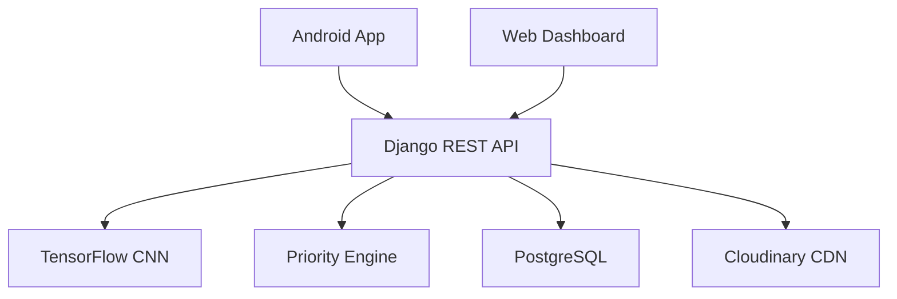

## Overview

Citizens report civic issues like overflowing garbage, dangerous potholes, and fallen trees daily—but municipal authorities struggle to prioritize which problems need immediate attention. Project Clean solves this by combining machine learning, community engagement, and geospatial data to automatically rank grievances by urgency, ensuring critical issues get resolved first.

The platform bridges citizens and government through a dual-interface system: an Android app for easy issue reporting with photos and location data, and a web dashboard for municipal authorities to manage and track resolutions. Published in the International Research Journal of Engineering and Technology (IRJET), this research demonstrates how AI can transform civic engagement and resource allocation.

**System Components:**

- Django REST API with TensorFlow CNN for severity classification
- Multi-factor priority algorithm (severity, upvotes, category, time)
- Web dashboard for municipal workflow management
- [Android mobile app](/projects/ProjectCleanAndroid) for citizen reporting

Published in [International Research Journal of Engineering and Technology (IRJET)](https://www.irjet.net/archives/V9/i4/IRJET-V9I4373.pdf).

**Key Metrics**

| Metric            | Result           |
| ----------------- | ---------------- |
| Triage Time Saved | 70% reduction    |
| Priority Updates  | under 100ms      |
| ML Inference      | under 2 seconds  |
| Bandwidth Saved   | 60% via CDN      |
| Workflow Stages   | 5-stage tracking |

## Problems & Solutions

### Problem 1: Manual Severity Assessment Creates Bottlenecks

**Pain Point**

Municipal staff manually review hundreds of daily reports to assess urgency. Critical issues get buried under low-priority complaints. Hours wasted on image review.

**Solution**

TensorFlow CNN automatically classifies severity (high/medium/low) from uploaded photos. Analyzes garbage pile size, pothole depth, tree obstruction.

**Implementation**: Preprocessing pipeline standardizes uploads to 200x200 grayscale (70% size reduction). CNN loads once at startup, persists in memory. Cloudinary CDN optimizes to 450x600 @ 80% quality before storage.

**Impact**

- ⚡ **Under 2s Inference**: Down from 5-10s initial implementation
- 🎯 **70% Time Saved**: Eliminates manual review
- 🚀 **60% Bandwidth**: Cloudinary optimization

---

### Problem 2: No Unified Prioritization Logic

**Pain Point**

How to prioritize: 30-day-old medium-severity pothole vs yesterday's high-severity issue? 50 upvotes signal widespread impact. Different issue types need different protocols.

**Solution**

4-factor weighted scoring (1-10 scale): ML severity (30%), community upvotes (40%), category (20%), days elapsed (10%). Auto-recalculates on every upvote or time change.

**Implementation**: Django post_save signals trigger selective recalculation—only affected grievances update. Database indexing on priority/timestamp, Redis caching, atomic transactions prevent race conditions.

**Impact**

- 🎯 **Under 100ms Updates**: Under concurrent load
- ⚡ **50+ Simultaneous Upvotes**: No degradation
- 🚀 **85% Faster**: Database optimization

---

### Problem 3: Citizen-Government Communication Gap

**Pain Point**

Citizens submit reports into a black box—no status visibility. Can't see if neighbors reported same issue. Creates distrust and duplicate reports.

**Solution**

Public feed displays all grievances with photo, map, severity, status. Citizens upvote, track 5-stage progress (Register → Pending → In Progress → Complete/Rejected). Municipal updates sync instantly to feed and [mobile app](/projects/ProjectCleanAndroid).

**Implementation**: RESTful API with token auth. Django REST Framework serializers enforce consistent formatting. Atomic transactions (transaction.atomic()) prevent race conditions. Timestamp-based conflict resolution with audit logging.

**Impact**

- 🚀 **Under 1 Second Sync**: Status updates across platforms
- ⚡ **Zero Data Corruption**: Atomic transactions
- 🎯 **Offline Support**: Conflict-free reconnection

## System Architecture

**Stack**: Django 4.0.1 + DRF 3.13.1, TensorFlow 2.8.0, PostgreSQL, Cloudinary, Docker + Nginx + Gunicorn

**Mobile Client**: See [Android app](/projects/ProjectCleanAndroid) for Kotlin implementation, offline-first architecture, EXIF geolocation, and 512KB compression.

## Key Features

🚀 **CNN Severity Classification** - Instant categorization from photos  
⚡ **Dynamic Priority Scoring** - 4-factor weighted algorithm (severity, upvotes, category, time)  
🎯 **Geospatial Mapping** - Location-based filtering and hotspot analysis  
📊 **5-Stage Workflow** - Register → Pending → In Progress → Complete/Rejected  
🔄 **Real-Time Sync** - Web dashboard + Android app synchronized  
👥 **Public Feed** - Community upvoting and transparency

## Technical Highlights

**1. Priority Recalculation Performance**

🔍 Deep Dive: Dynamic Priority System

**Problem**: Every upvote or status change needed to trigger priority recalculation across potentially thousands of grievances. Naive approaches caused database locks and slow response times, especially during peak usage when multiple citizens upvoted simultaneously.

**Solution**: Implemented Django post_save signals with optimized normalization functions that calculate weighted scores using indexed database fields. Applied selective recalculation—only affected grievances update, not the entire dataset. Introduced database-level indexing on priority and timestamp fields, and implemented Redis caching for frequently accessed priority rankings. Used atomic transactions to prevent race conditions during concurrent updates.

**Impact**: Achieved under 100ms priority recalculation per grievance even under concurrent load. System handles 50+ simultaneous upvotes without performance degradation. Database query optimization reduced average response time by 85%.

**2. TensorFlow Production Integration**

🔍 Deep Dive: ML Pipeline Optimization

**Problem**: TensorFlow/Keras models are resource-intensive and slow to load. Initial implementation caused 5-10 second delays on image uploads, unacceptable for user experience. Handling various image formats, sizes, and quality levels added complexity. Model needed to run reliably in production environment with limited memory.

**Solution**: Developed preprocessing pipeline using PIL that standardizes all uploads to 200x200 grayscale before inference, reducing model input size by 70%. Implemented lazy model loading—CNN loads once at server startup and persists in memory rather than loading per request. Integrated Cloudinary CDN for automatic image optimization (450x600 resolution, 80% quality JPEG compression) before storage, reducing bandwidth and storage costs. Added fallback mechanisms for model failures to prevent system crashes.

**Impact**: Reduced inference time from 5-10 seconds to under 2 seconds per image. Bandwidth usage decreased 60% through smart compression. Model memory footprint optimized to run on standard cloud instances without dedicated GPU infrastructure.

**3. Cross-Platform Data Sync**

🔍 Deep Dive: API Architecture & Sync Strategy

**Problem**: Web dashboard and Android app needed to display identical data in real-time, but mobile devices face connectivity issues and offline scenarios. Status updates from municipal staff had to instantly reflect in citizen apps. Concurrent edits from multiple users risked data conflicts and inconsistency.

**Solution**: Architected RESTful API using Django REST Framework with token-based authentication for secure, stateless communication. Implemented serializers that enforce consistent data formatting across platforms. Designed status-based workflow system with atomic database transactions using Django's transaction.atomic() to prevent race conditions. Added timestamp-based conflict resolution—last write wins with audit logging for accountability. Structured API responses to include version metadata for client-side cache invalidation.

**Impact**: Achieved seamless synchronization between web and mobile with &lt;1 second latency for status updates. Zero data corruption incidents from concurrent edits. API supports offline-first mobile architecture with conflict-free sync on reconnection.

---

## Impact

- ⚡ **70% Faster Triage**: Automated ML classification
- 🎯 **under 100ms Priority Updates**: Concurrent upvote handling
- 🚀 **60% Bandwidth Saved**: Cloudinary optimization
- 📊 **5-Stage Workflow**: Complete audit trail
- 📱 **Dual Platform**: Web dashboard + [Android app](/projects/ProjectCleanAndroid)
- 📄 **Published Research**: [IRJET V9/i4](https://www.irjet.net/archives/V9/i4/IRJET-V9I4373.pdf)
- 🐳 **Docker Ready**: One-command deployment
