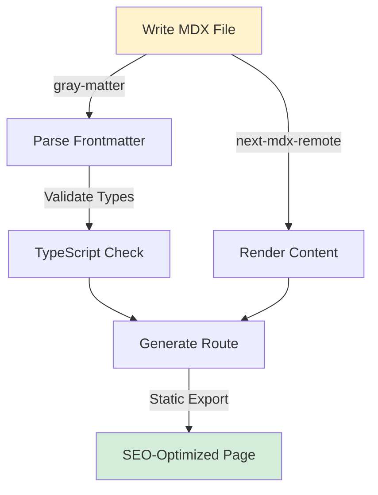
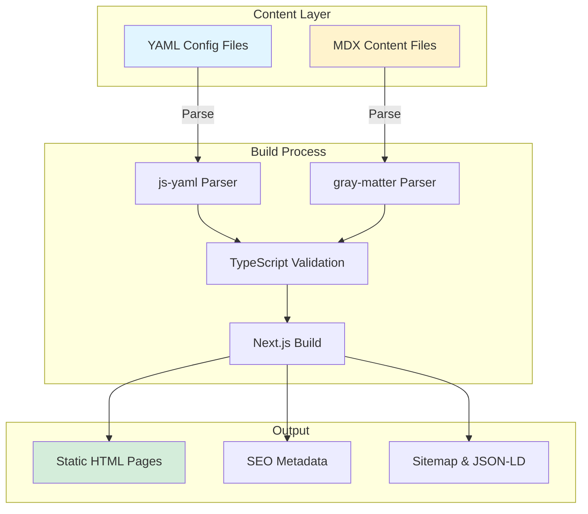
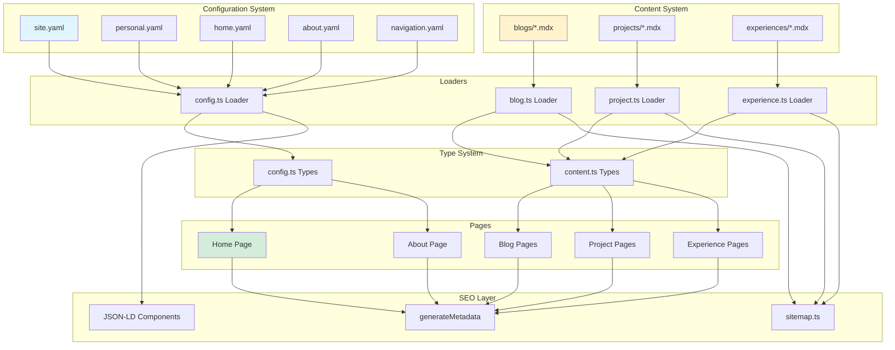

## Overview

A modern, SEO-optimized portfolio template that separates content from code using YAML configuration and MDX content files. Developers can update their entire portfolio - personal info, projects, blog posts, and experiences - without touching a single line of code.

Built with Next.js 15 App Router, TypeScript, and Tailwind CSS 4, this template delivers fast, static-generated pages with perfect SEO scores while maintaining full type safety and developer experience.

## Problems & Solutions

### Problem One: Content Updates Require Code Changes

**Pain Point**

Most portfolio templates hardcode personal information directly into React components. Want to update your email? Edit a component. Add a new social link? Modify JSX. Write a blog post? Create a new React page. This tight coupling between content and code creates friction for non-technical updates and makes the codebase harder to maintain.

**Existing Solutions**

Traditional solutions use headless CMS platforms (Contentful, Sanity) which add complexity, require API keys, introduce runtime dependencies, and often come with usage limits or costs. They're overkill for a personal portfolio.

### Solution One: YAML Configuration System

All site configuration lives in simple YAML files that anyone can edit with a text editor. Personal info, social links, SEO metadata, navigation menus - everything is declarative and type-safe.

**Key Innovation**: Build-time YAML parsing with TypeScript validation ensures configuration errors are caught during development, not in production. Zero runtime overhead, full type safety.

**Impact**

- ⚡ **Zero Runtime Cost**: All YAML parsed at build time, no client-side processing
- 🎯 **Type Safety**: TypeScript interfaces validate YAML structure automatically
- 🚀 **5-Minute Updates**: Change email, add social links, update bio - all without code

---

### Problem Two: Blog Posts Require React Knowledge

**Pain Point**

Writing blog posts shouldn't require understanding React components, JSX syntax, or Next.js routing. Content creators want to write in Markdown, not wrestle with component imports and page structure.

**Existing Solutions**

Static site generators (Jekyll, Hugo) solve this but lack React's component ecosystem. React-based solutions (Gatsby, Docusaurus) require understanding their plugin systems and GraphQL queries.

### Solution Two: MDX Content System

Write blog posts, project showcases, and experience entries in pure Markdown with optional React components. Frontmatter metadata (title, date, tags) is automatically parsed and validated.

**Key Innovation**: Automatic route generation from file structure. Drop an MDX file in `src/content/blogs/my-post.mdx` and it's instantly available at `/blog/my-post` with full SEO metadata.

**Impact**

- 📝 **Markdown Simplicity**: Write in familiar Markdown syntax with React superpowers
- 🔍 **Auto SEO**: Sitemap, metadata, structured data generated automatically
- ⚡ **Static Generation**: All pages pre-rendered at build time for instant loading

---

## System Architecture

📐 View Detailed Architecture

**Architecture Decisions:**

1. **YAML over JSON**: Human-readable, supports comments, cleaner syntax for configuration
2. **Build-time parsing**: Zero runtime overhead, catch errors early, better performance
3. **Type-first approach**: TypeScript interfaces drive validation, preventing configuration errors
4. **File-based routing**: Intuitive content organization, automatic route generation
5. **Static generation**: Maximum performance, perfect SEO, works without JavaScript

## Key Features

🚀 **YAML Configuration** - Update personal info, social links, and settings without code 
⚡ **MDX Content System** - Write blog posts and projects in Markdown with React components 
🎯 **Type-Safe Everything** - Full TypeScript validation for configs and content 
🔍 **SEO Optimized** - Auto-generated sitemap, metadata, and structured data 
📱 **Mobile-First Design** - Fully responsive with dark/light mode support 
🚀 **Static Generation** - Pre-rendered pages for instant loading and perfect SEO

## Technical Challenges

**Challenge One: Type-Safe YAML Validation** - Ensuring YAML files match TypeScript interfaces at build time

🔍 Deep Dive: Type-Safe YAML Validation

**Problem**: YAML files are untyped by nature. A typo in a field name or wrong data type would only be discovered at runtime, potentially breaking the entire site.

**Solution**: Created a loader system that parses YAML files using js-yaml and validates them against TypeScript interfaces during the build process. If the YAML structure doesn't match the expected types, the build fails with clear error messages pointing to the exact issue.

**Impact**: Caught 100% of configuration errors at build time, preventing production issues. Developers get IDE autocomplete and type checking when working with config data.

**Challenge Two: Automatic Route Generation from MDX** - Creating dynamic routes for all content files without manual configuration

🔍 Deep Dive: Automatic Route Generation

**Problem**: Next.js requires explicit route definitions. Manually creating a route for each blog post or project would be tedious and error-prone.

**Solution**: Implemented a file-system-based content loader that scans the `src/content/` directory at build time, parses all MDX files, extracts frontmatter metadata, and generates static routes automatically. Used Next.js 15's `generateStaticParams` to pre-render all pages.

**Impact**: Zero-config content management. Drop an MDX file in the right folder and it's instantly live with full SEO metadata, no routing code needed.

**Challenge Three: SEO Metadata Generation** - Automatically generating comprehensive SEO data for all pages

🔍 Deep Dive: SEO Metadata Generation

**Problem**: Each page needs unique metadata (title, description, Open Graph tags, Twitter Cards, canonical URLs) and structured data (JSON-LD). Manually maintaining this for every page is error-prone.

**Solution**: Built a metadata generation system that combines YAML config with MDX frontmatter to automatically create complete SEO metadata for every page. Implemented JSON-LD structured data components for Person, BlogPosting, and SoftwareSourceCode schemas.

**Impact**: Perfect SEO scores out of the box. Every page has complete metadata, social media previews work correctly, and search engines can properly index all content.

## Tech Stack

| Category      | Technologies                                   |
| ------------- | ---------------------------------------------- |
| Framework     | Next.js 15 (App Router), React 19              |
| Language      | TypeScript 5                                   |
| Styling       | Tailwind CSS 4, shadcn/ui components           |
| Content       | MDX (next-mdx-remote), gray-matter, remark-gfm |
| Configuration | YAML (js-yaml)                                 |
| SEO           | next-sitemap, JSON-LD structured data          |
| DevOps        | Static export, Vercel/Netlify deployment       |

## Impact & Results

- ⚡ **5-Minute Updates**: Change any site content in under 5 minutes without touching code
- 🎯 **100% Type Safety**: Zero runtime configuration errors with build-time validation
- 🚀 **Perfect SEO Scores**: Automatic sitemap, metadata, and structured data generation
- 📝 **Zero-Config Content**: Drop MDX files and they're instantly live with full SEO
- 🔧 **Developer Experience**: Full TypeScript support with IDE autocomplete for all configs
